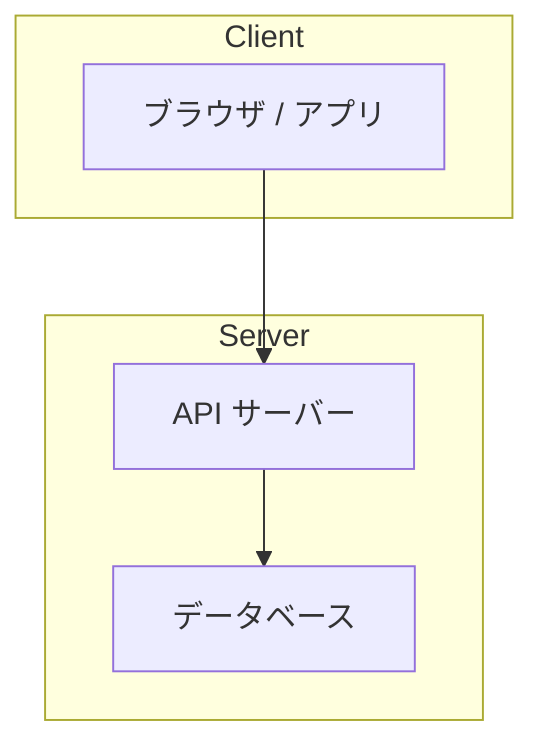
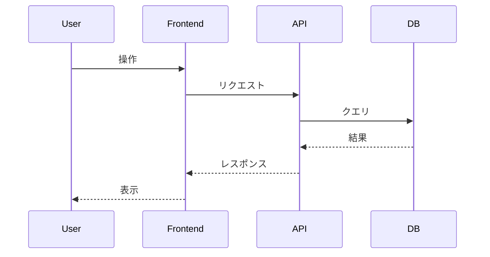
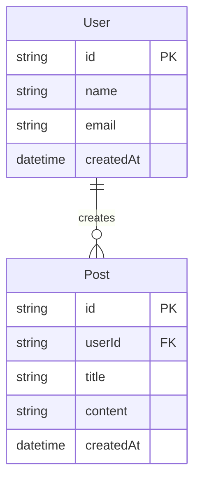

# 設計書: {プロジェクト名}

## 1. システム概要

- 目的：
- 主要な機能：

## 2. アーキテクチャ概要

### 構成図



### アーキテクチャパターン

- 採用パターン：（例: レイヤードアーキテクチャ、クリーンアーキテクチャ、MVC など）
- 選定理由：

## 3. コンポーネント設計

| コンポーネント | 責務 | 依存先 |
|--------------|------|-------|
| - | - | - |

### コンポーネント詳細

#### {コンポーネント名}

- 責務：
- 主要な処理：
- 公開インターフェース：

## 4. データフロー

### 主要ユースケースのシーケンス



## 5. ディレクトリ構成

```
project-root/
├── src/
│   ├── components/    # UIコンポーネント
│   ├── pages/         # ページコンポーネント
│   ├── hooks/         # カスタムフック
│   ├── utils/         # ユーティリティ関数
│   ├── types/         # 型定義
│   └── api/           # API クライアント
├── public/            # 静的ファイル
├── tests/             # テストファイル
└── docs/              # ドキュメント
```

## 6. データモデル

### エンティティ関連図



### エンティティ詳細

| エンティティ | 属性 | 型 | 説明 |
|------------|------|-----|------|
| - | - | - | - |

## 7. API 設計（該当する場合）

### エンドポイント一覧

| メソッド | パス | 説明 | リクエスト | レスポンス |
|---------|------|------|-----------|-----------|
| GET | /api/users | ユーザー一覧取得 | - | User[] |
| POST | /api/users | ユーザー作成 | { name, email } | User |

### 認証・認可

- 認証方式：
- 認可ルール：

## 8. エラーハンドリング

### エラー分類

| 種別 | HTTPステータス | 対応方針 |
|------|--------------|----------|
| バリデーションエラー | 400 | エラー内容をユーザーに表示 |
| 認証エラー | 401 | ログイン画面へリダイレクト |
| 権限エラー | 403 | エラーメッセージを表示 |
| サーバーエラー | 500 | 汎用エラー画面を表示 |

## 9. セキュリティ考慮事項

- [ ] 入力値のバリデーション
- [ ] SQLインジェクション対策
- [ ] XSS対策
- [ ] CSRF対策
- [ ] 認証情報の安全な管理

## 10. 未決定事項（TBD）

- 
